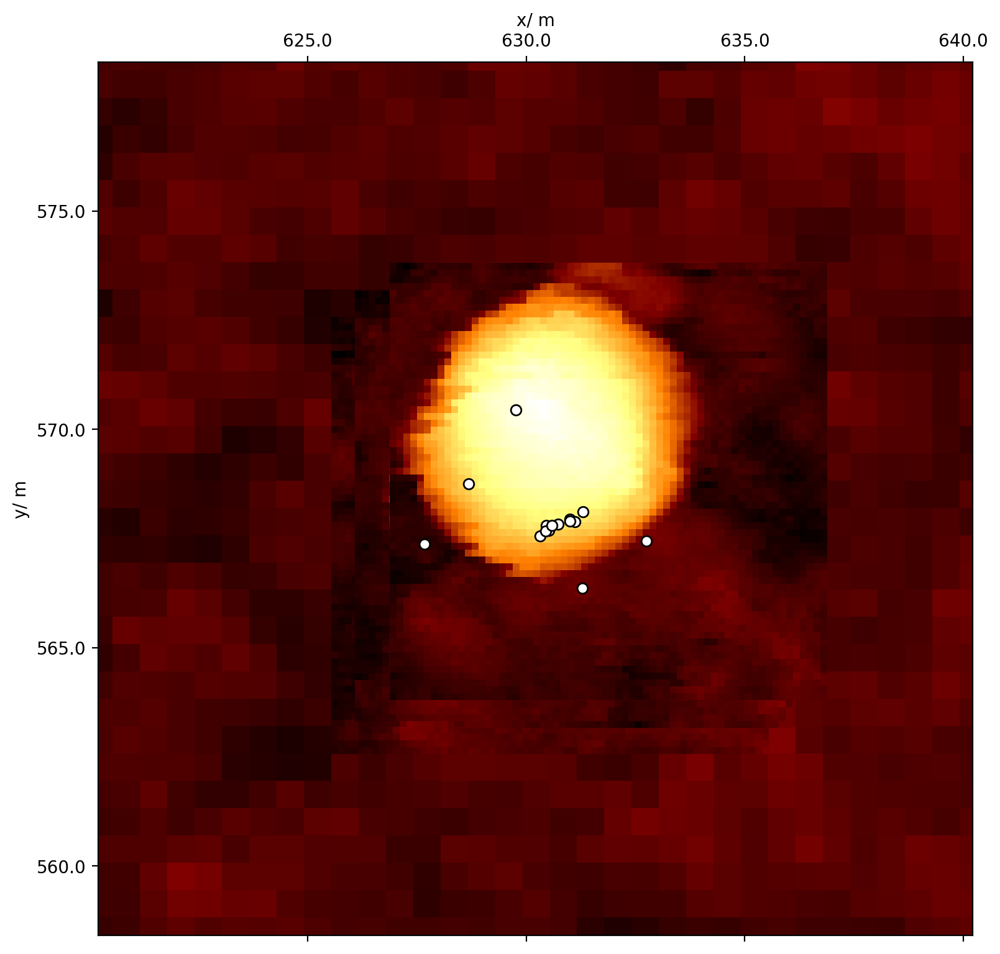
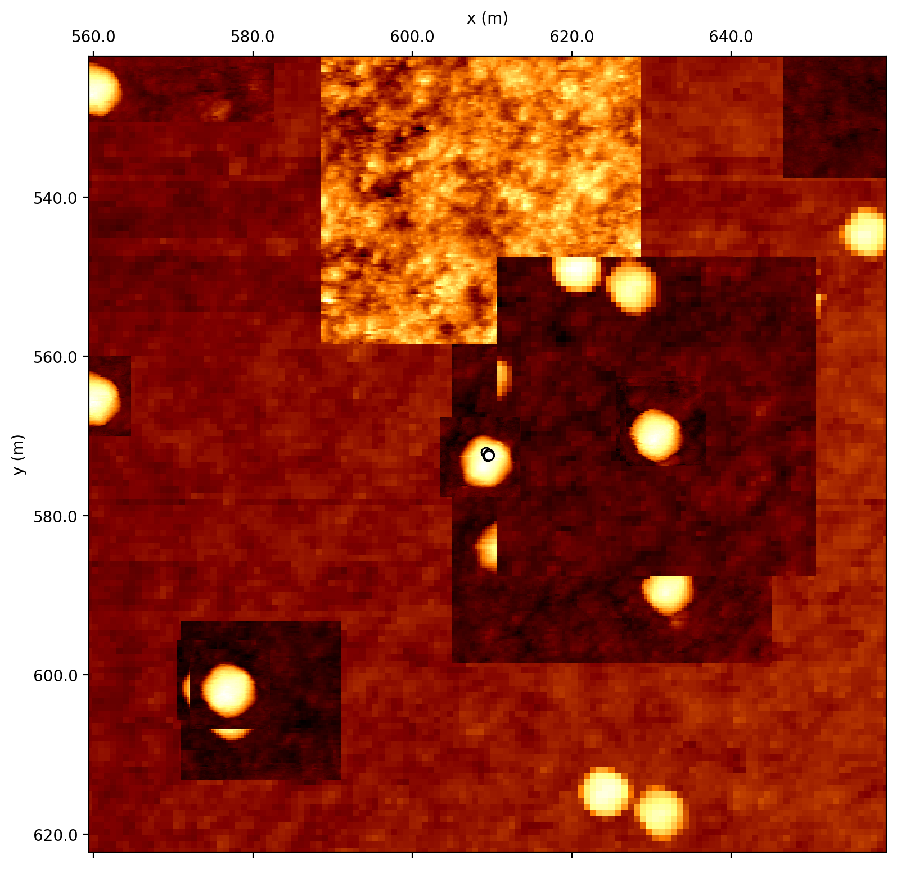

# Nanonis
 Python library for dealing with Nanonis data, ie .sxm image data and .dat spectroscopy.

Implements classes to open .sxm and .dat files. organise_spectra will sort files by acquisition time. create_map will plot all image and spectroscopy data onto one plot as an overview, see the examples below.

